# 1. Creating Azure App service from Azure portal

### 1.1 Search for webapp in `Azure search panel` on the top

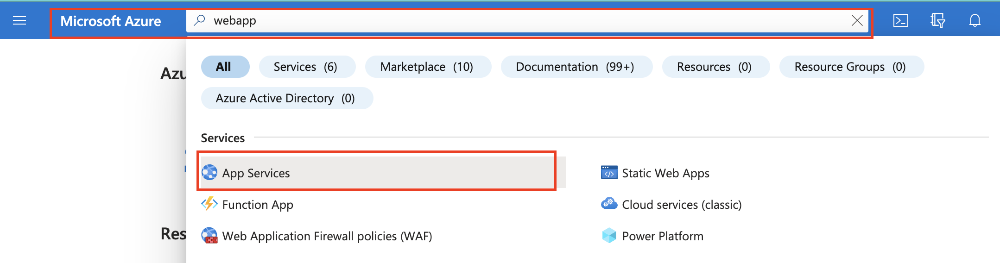

### 1.2 Click on `Create` drop down and click on `WebApp`

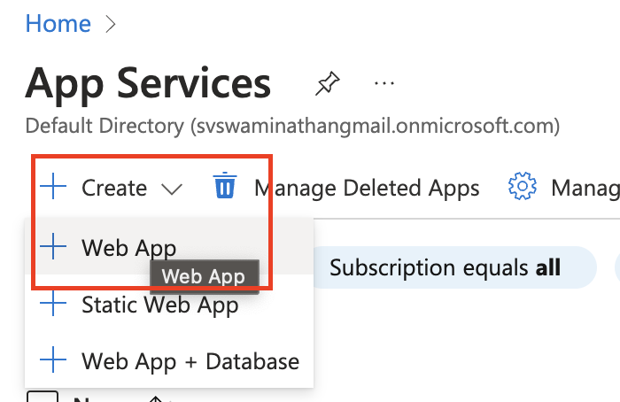

### 1.3 Create new resource group for the `web app`

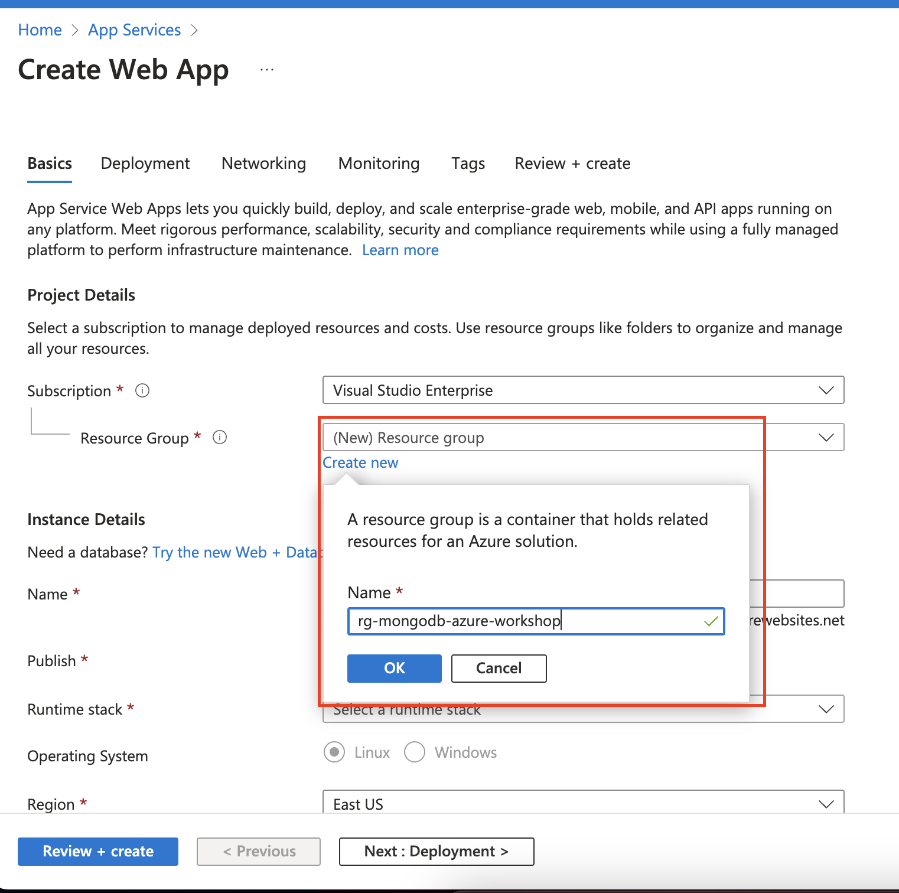

### 1.4 Choose an unique name, runtime stack and OS

- Choose an unique name `prefix your name to make the DNS globally unique`
- Choose `Pubish` as `Code`
- Choose `Runtime stack` as `.NET 6(LTS)`
- Choose `Operating System` as `Linux`
- Choose `Region` as `Central India`
- Click on Deployment
  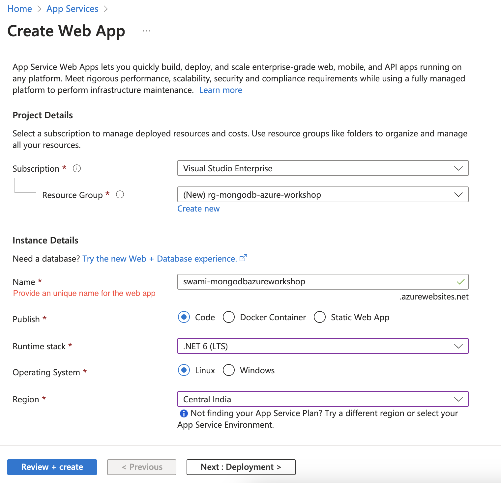

### 1.5 Choose App service plan

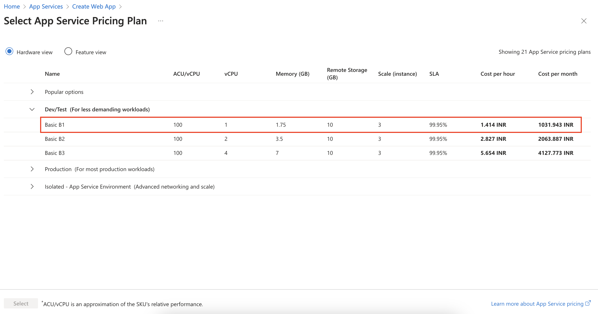

### 1.6 Choose Deployment options

`

- Leave the Continuous deployment as `Disable`
- Click on `Networking`

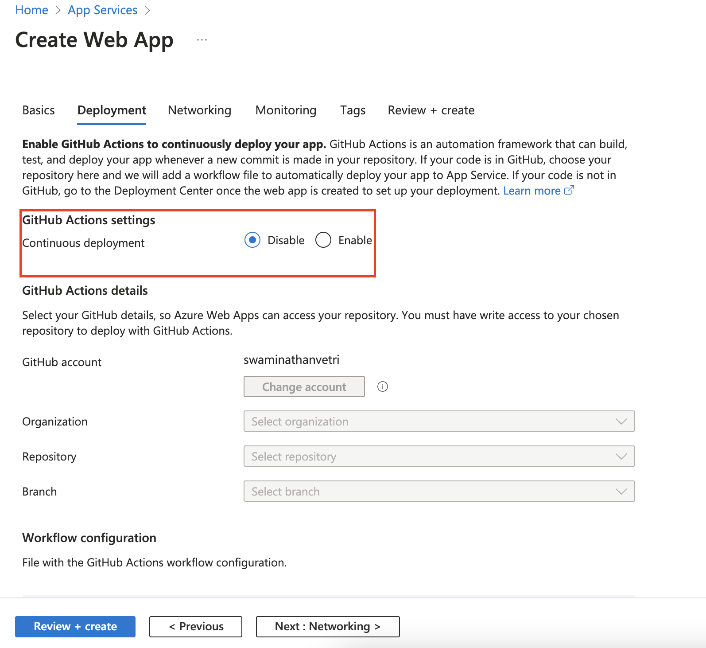

### 1.7 Choose Networking options

- Leave the default selection `as-is` and click `Monitoring`
  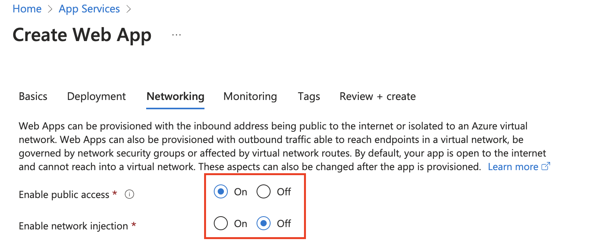

### 1.8 Choose Monitoring options

- Disable `Application Insights` _Only for demo purposes_
- Click on `Tags`

  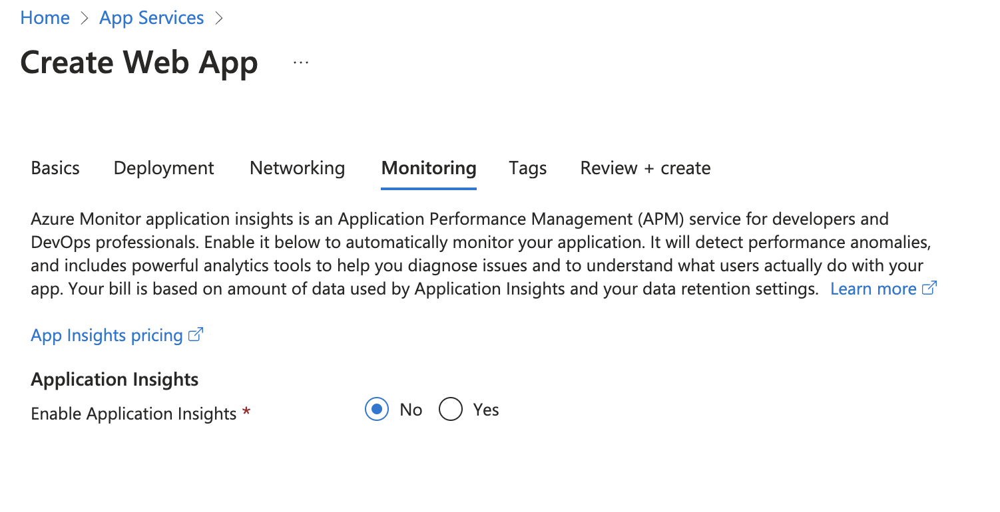

### 1.9 Create tags

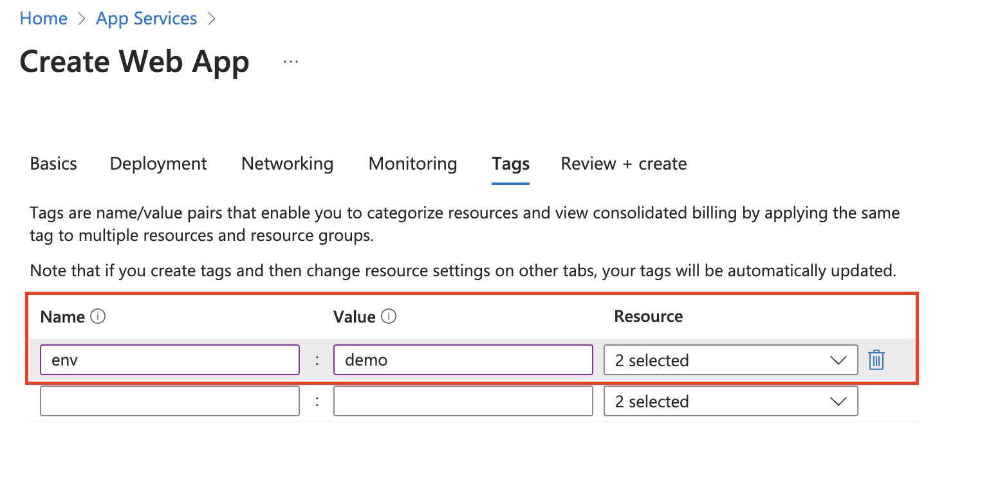

### 1.10 Review and Create

- Click on Review + Create
  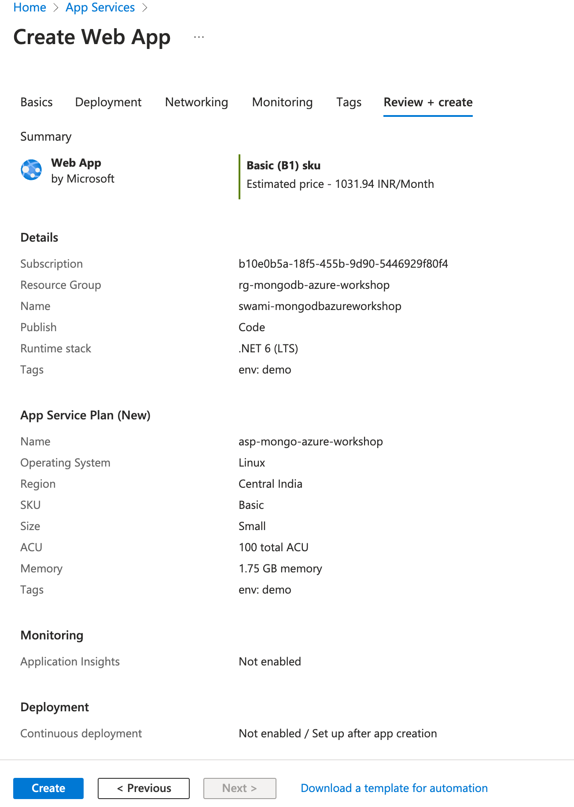

### 1.11 Monitor Deployment progress

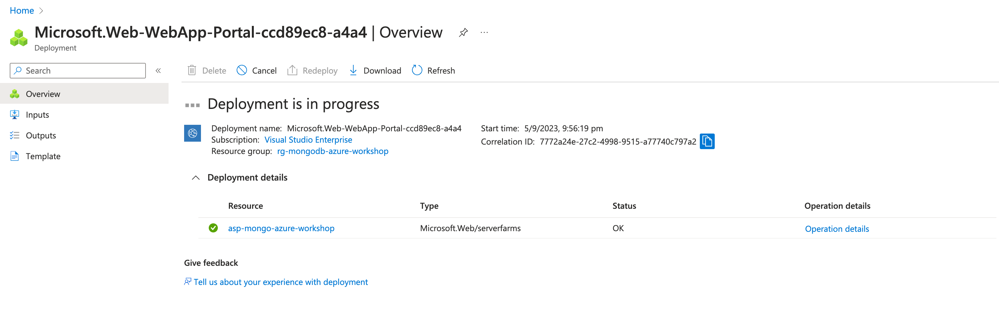

### 1.12 Deployment Notification

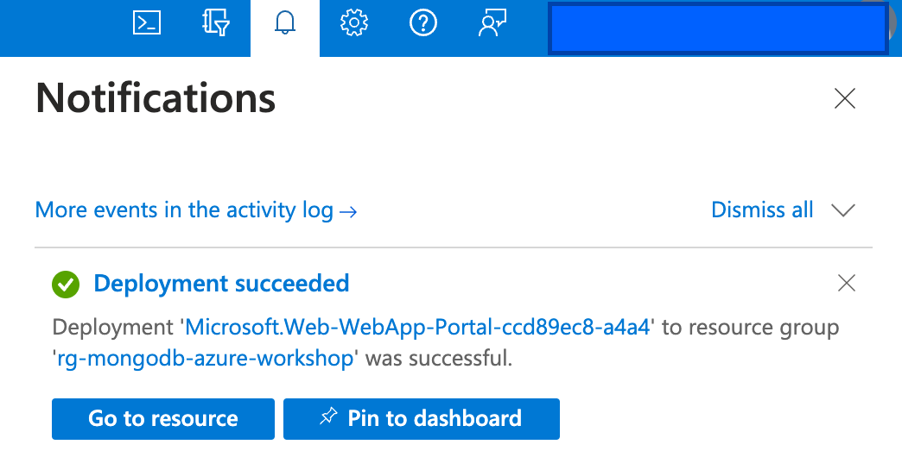
