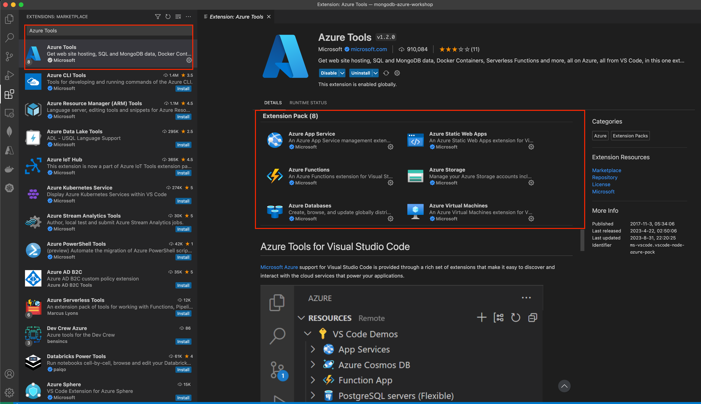
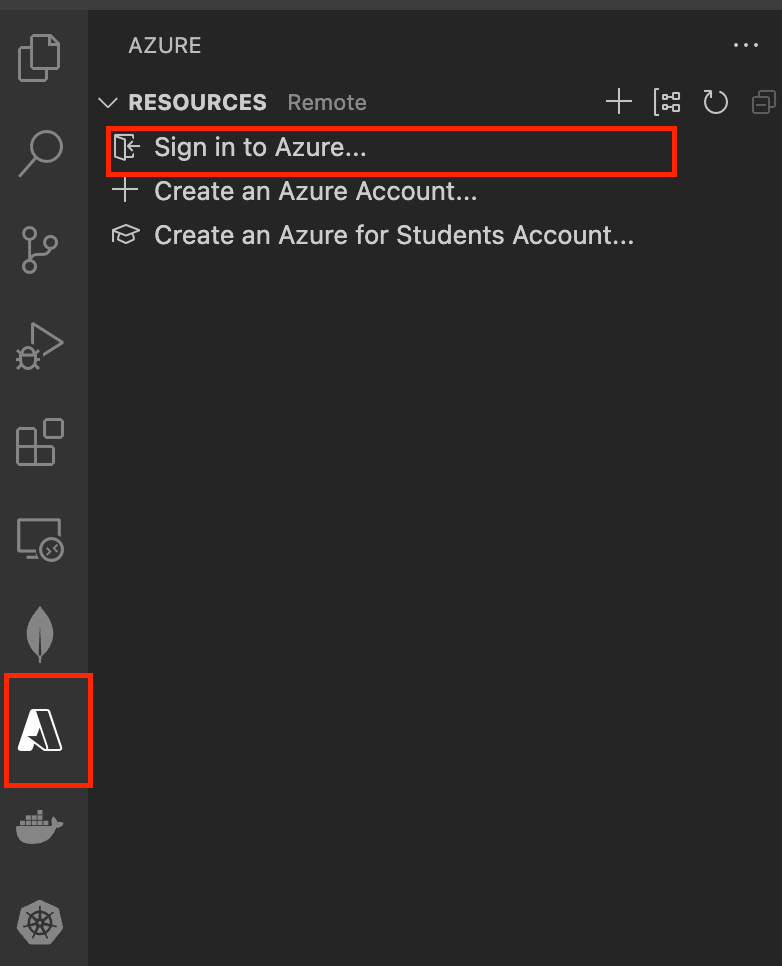
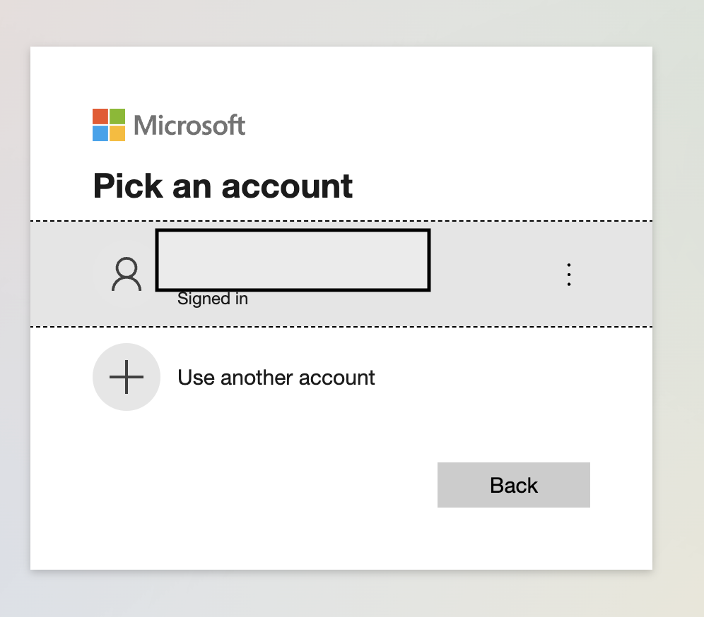
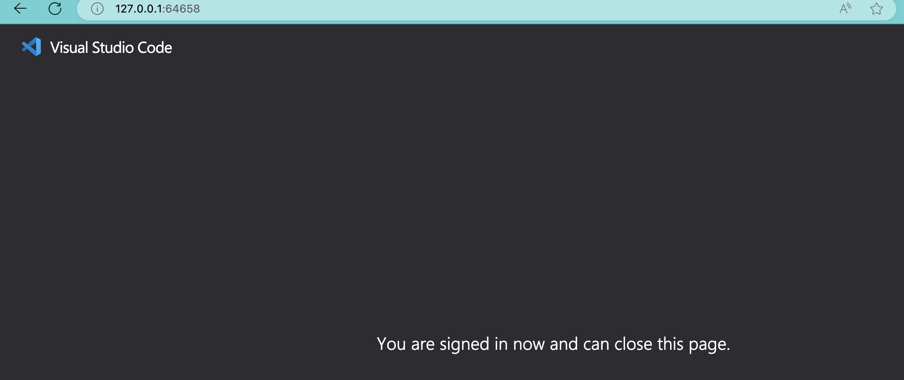
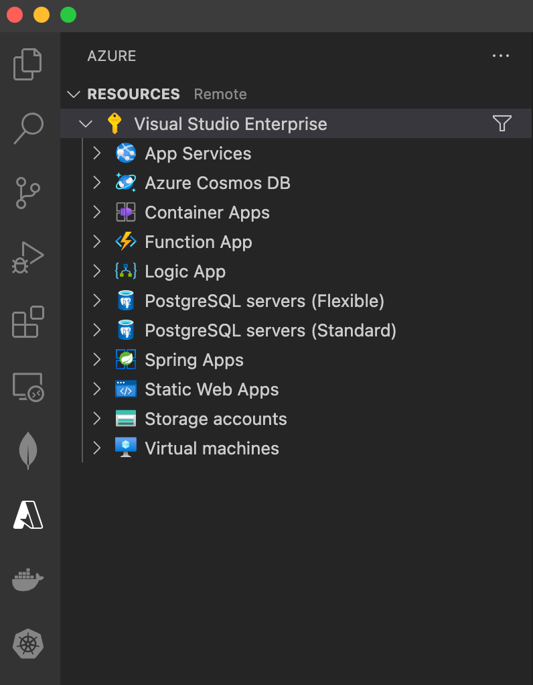

# 2. Setting up VS Code with Azure Tools Extension

### 2.1 Install `Azure Tools extension in VS Code`

### 2.2 Sign in to Azure

#### 2.2.1 Sign in

#### 2.2.2 Pick Azure Login

#### 2.2.3 Azure login confirmation in the browser

#### 2.2.4 Signed in View in `VS Code`

