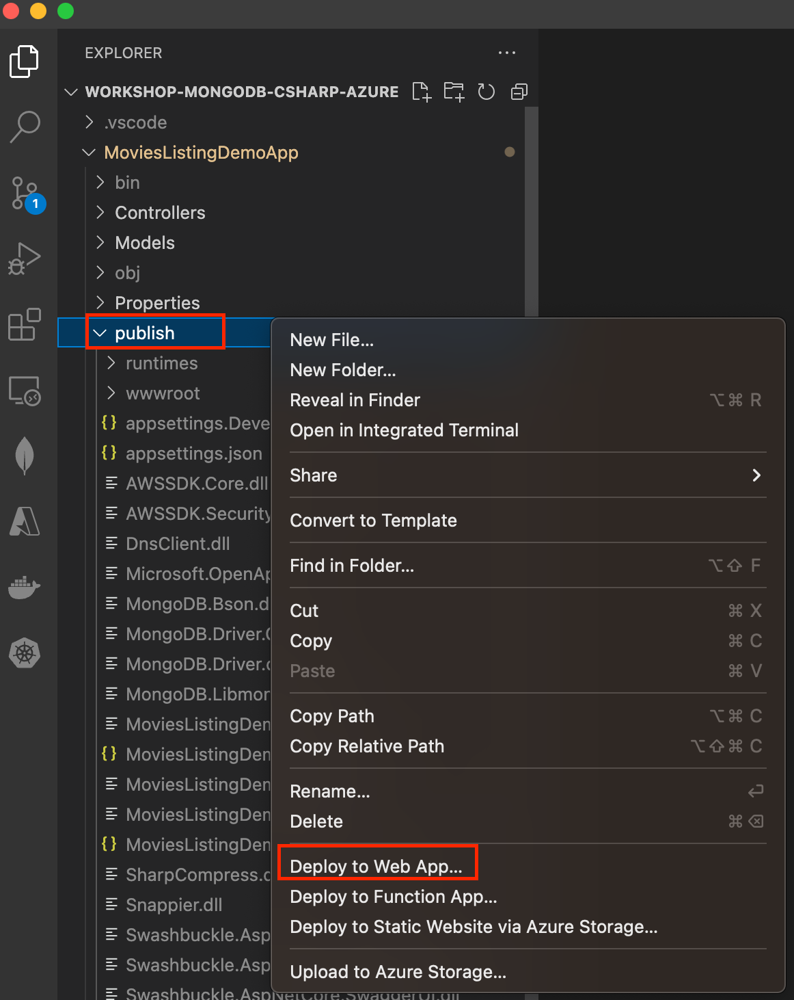
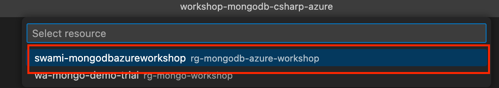
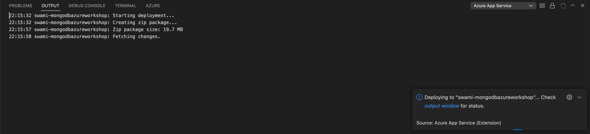
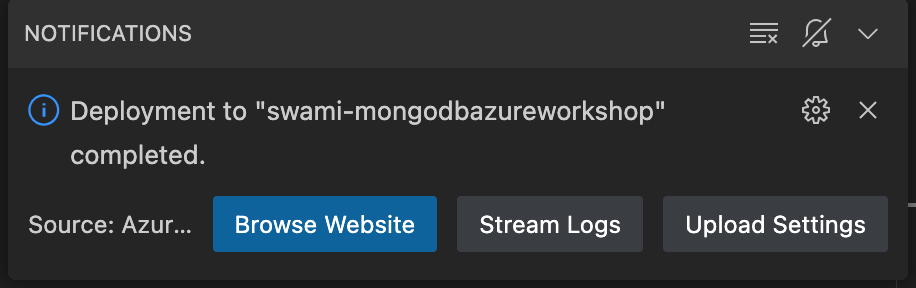

# 3. Deploying dotnet app from VSCode to Azure App service

### 3.1 Publish the dotnet app into local folder

To publish the application, Navigate to the folder from the `terminal` or `command prompt` where `.csproj` file is present run the below command

`dotnet publish -o /.publish`

You should see a new `publish` folder created alongside other folders which will contain the published DLLs

### 3.2 Deploy the publish folder to Azure app service

#### 3.2.1 Right click on the `publish` folder and click `Deploy to webapp`

#### 3.2.2 Choose the Azure app service that was created in step `1`

#### 3.2.3 Provide confirmation for deployment

#### 3.2.4 Monitor the deployment progress in `output` window

- Monitor deployment
  

#### 3.2.5 Browse to the web app once deployment is done

`Allow access from ALL network in MongoDB Atlas to enable access to the DB from Azure` - **ONLY for Demo purpose, this is strictly prohibited for production workloads**

---

Congratulations - You finished the first module :clap: :fire: :tada:

---
