# Bonus exercises

## 1. Reading the secrets from Azure Key Vault

### 1.1 Create Azure Key Vault

#### 1.1.1 Choose unique name, region, pricing tier

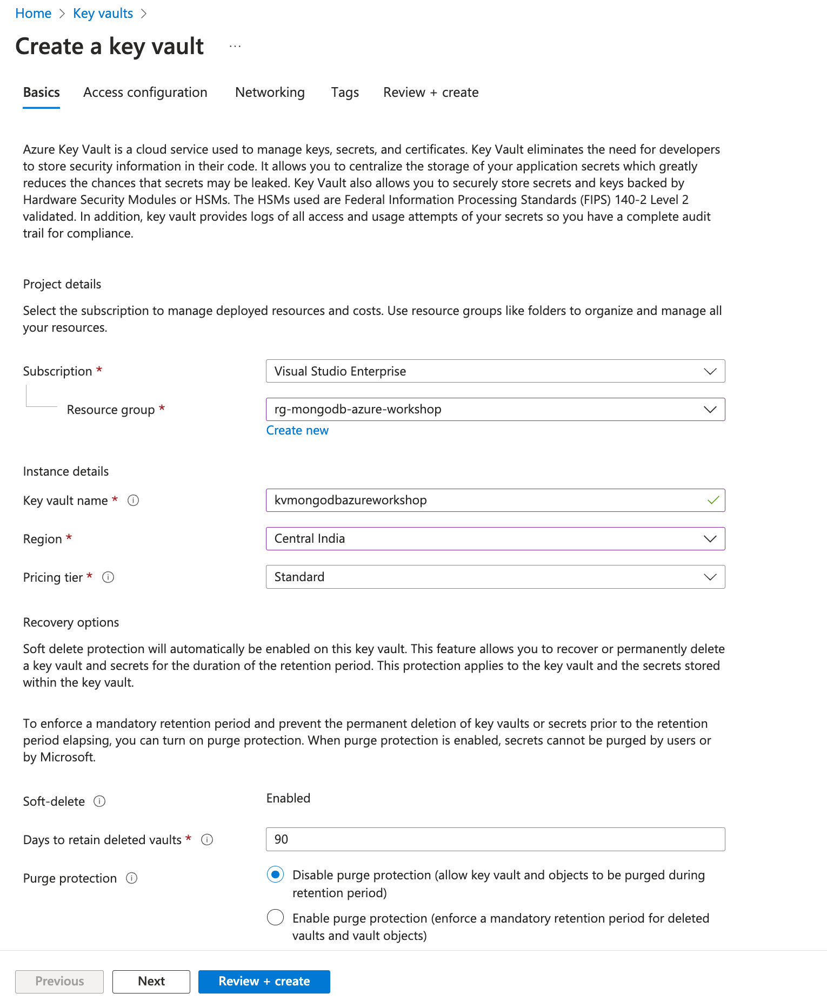

#### 1.1.2 Choose access configuration

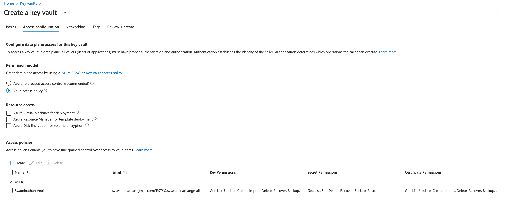

#### 1.1.3 Choose networking option

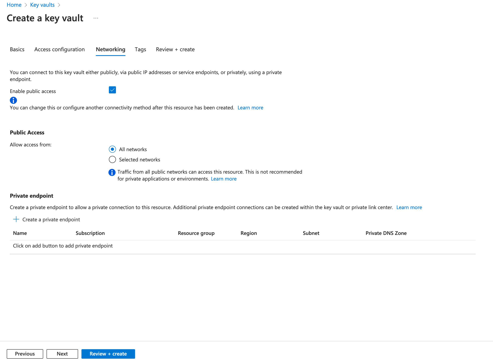

- Add tags in the next screen

#### 1.1.4 Review and Create

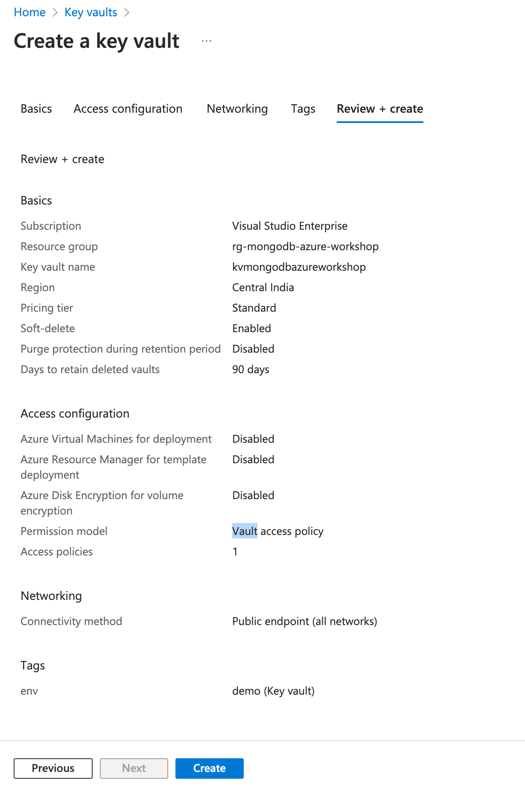

### 1.2 Create secret in Azure Key Vault

- Pick the connection string from Mongo DB Cloud Connect panel and add as a secret
  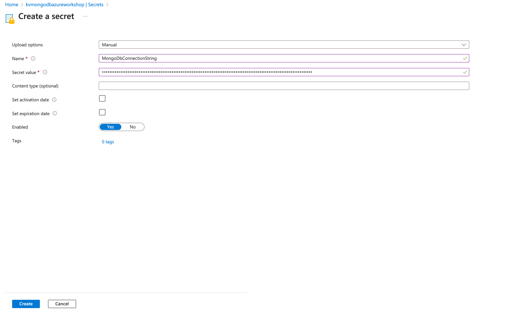

### 1.3 Create managed identity for Azure App service

Click on `Identity` menu item and enable `System Managed Identity`

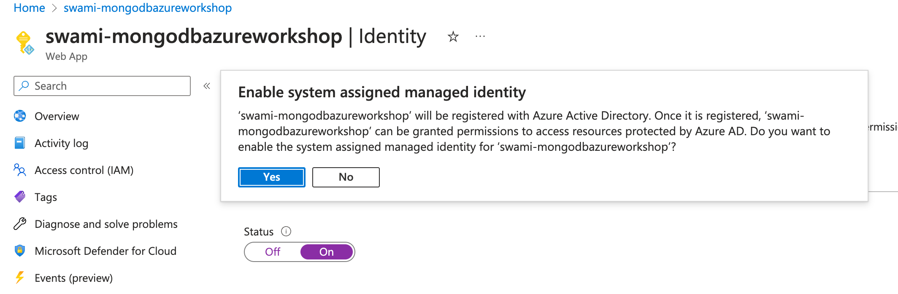

Copy the Object id once Managed identity is created

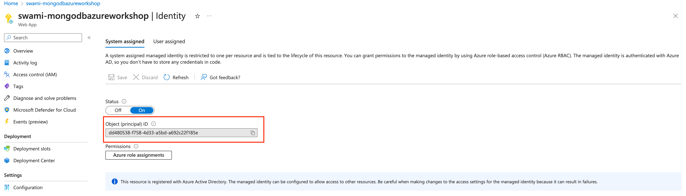

### 1.4 Setup key vault access to Azure app service

- Click on `Access Policy` in the Azure Key Vault created in Step 1
- Click on `Create Access Policy`
- Choose the `Permissions`

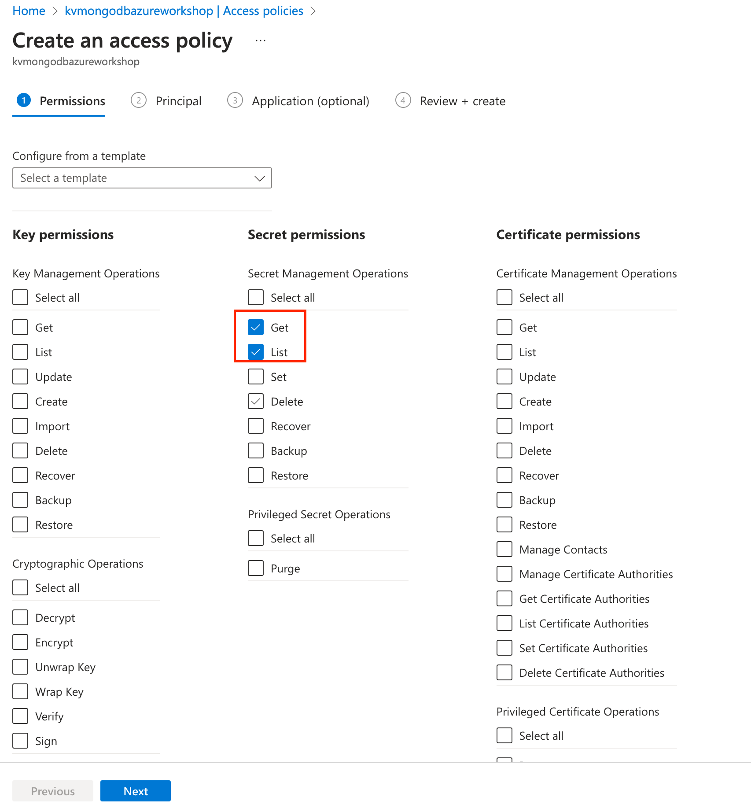

- Choose the `Principal` -> _Search for the app service name here_

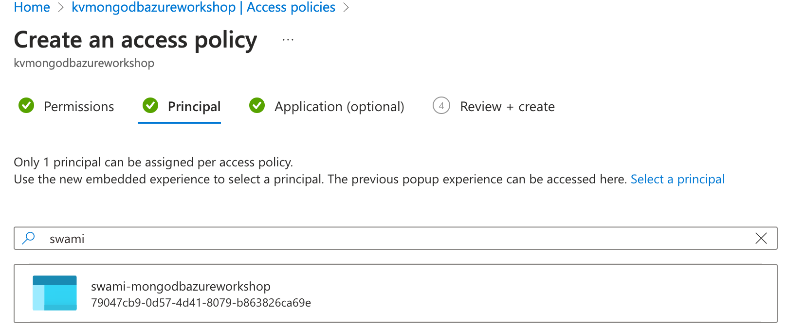

- Review and create

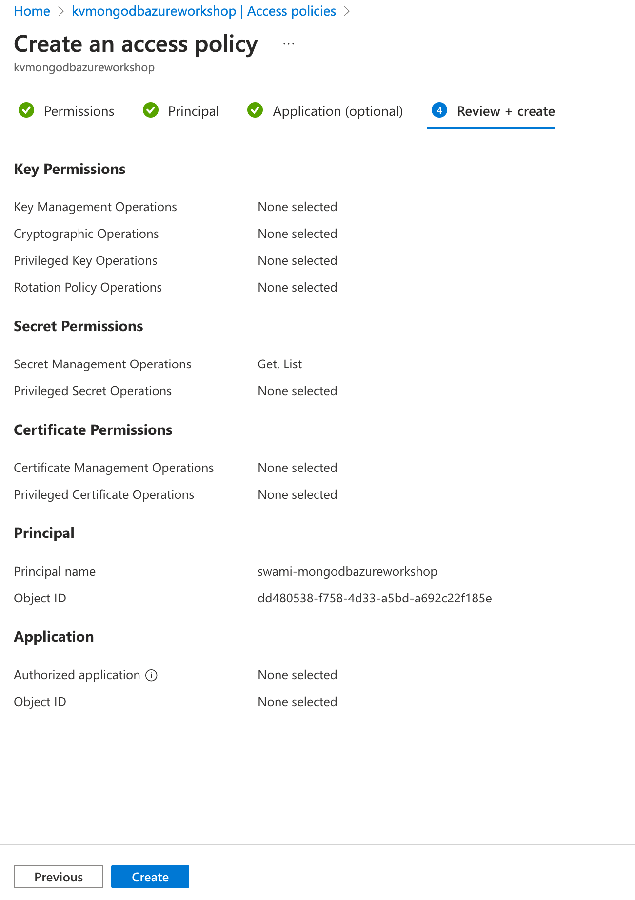

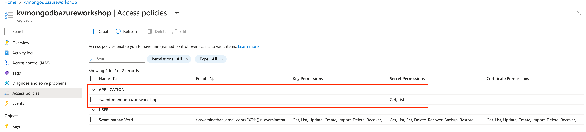

### 1.5 Update appsettings value to refer from keyvault

- Click on `Configuration` menu in the `Azure App Service`
- Click on `Application Settings` tab
- Click on `New Application Settings`
- Give the key as `MongoDB__ConnectionURI`
- Give the value as `@Microsoft.KeyVault(SecretUri=<pick value from your kv secret>)`
- Click on `Save`

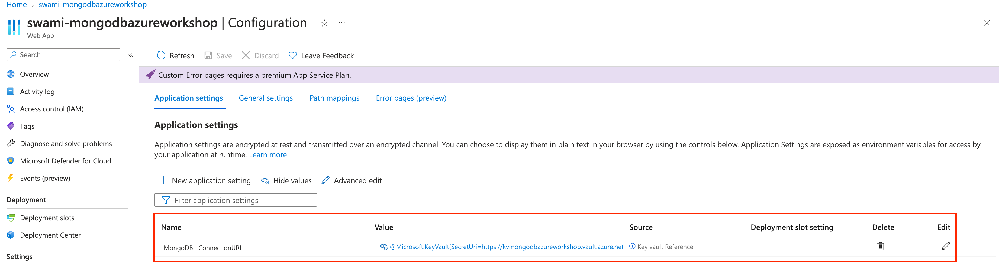

### 1.6 Redeploy the application after removing connection string value in `appSettings.json`

## 2. Setting up continuous deployment from Azure Portal

### 2.1 Fork the repository to your account

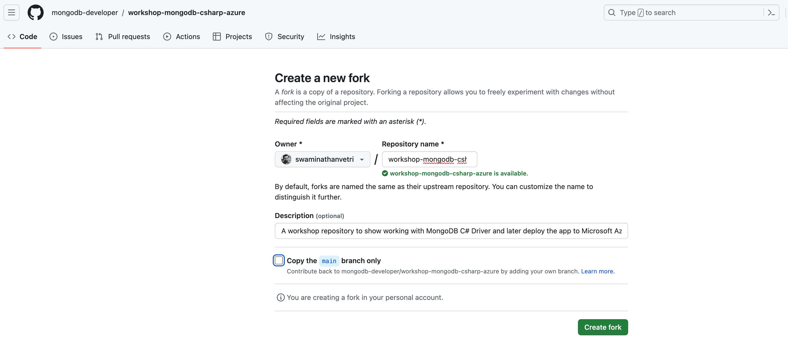

### 2.2 Create a pull request from feature/workshop-4 branch to main

### 2.3 Merge the PR

### 2.4 Setup CI/CD from GitHub repo

### 2.4.1 Download Azure Publish profile and Setup GitHub secret

- Navigate to the Azure Web App in Azure portal
- Click on Download publish profile

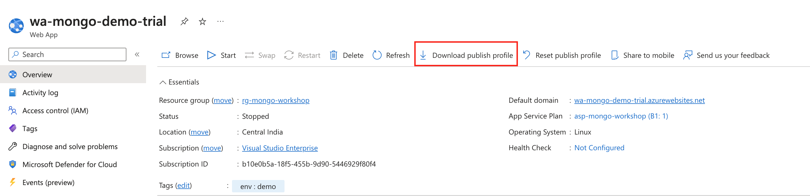

- Copy the contents of the publish profile and create `secrets` under Repo `Settings`

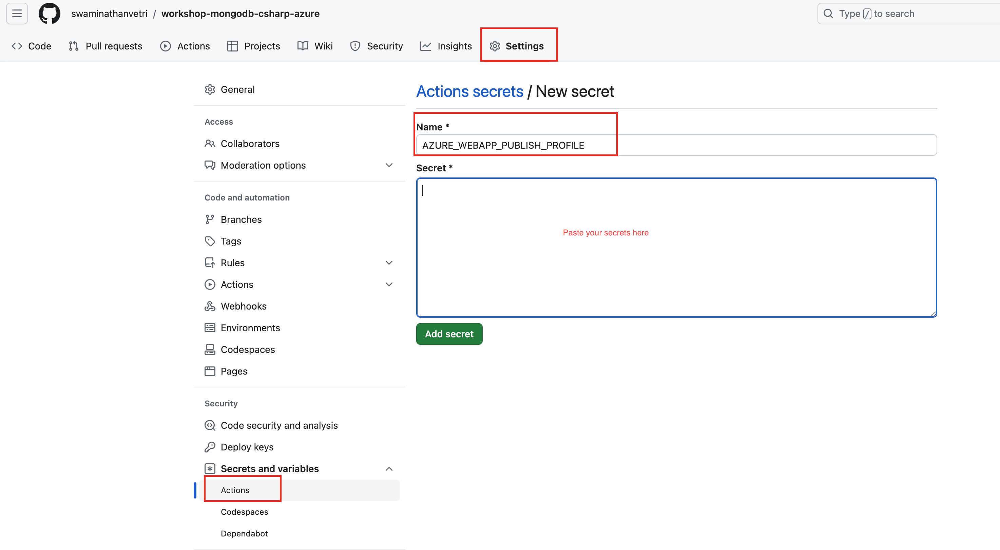

### 2.4.2 Navigate to actions tab and choose Deployment template

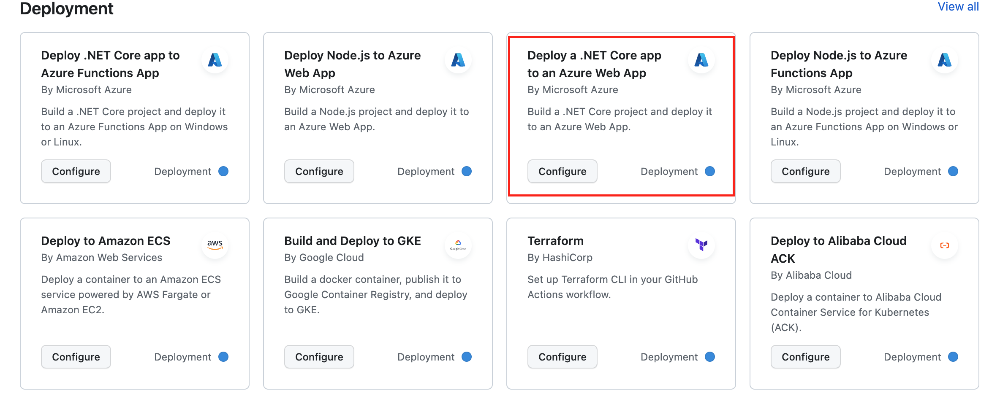

Modify the environment variables as follows

- `AZURE_WEBAPP_NAME: <your azure web app name>`
- `DOTNET_VERSION: 6.0.x`
- Commit the workflow file

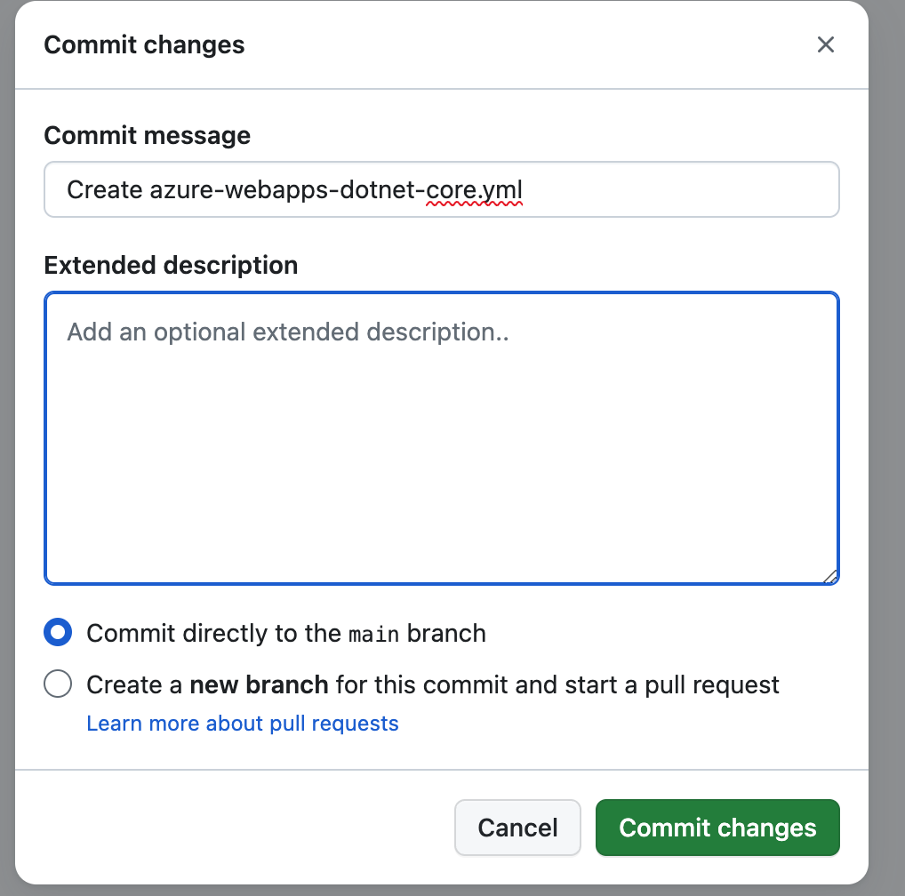

### 2.4.3 Monitor Deployment in Actions tab

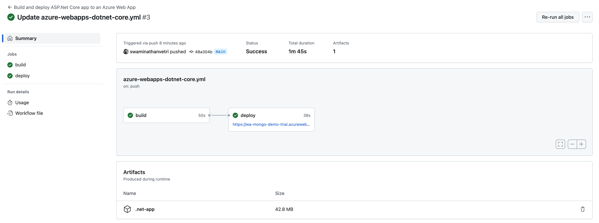

Click on the link present in `deploy` job and browse the webapp

---

# Congratulations you have just setup CI/CD :clap: :fire: :tada:
